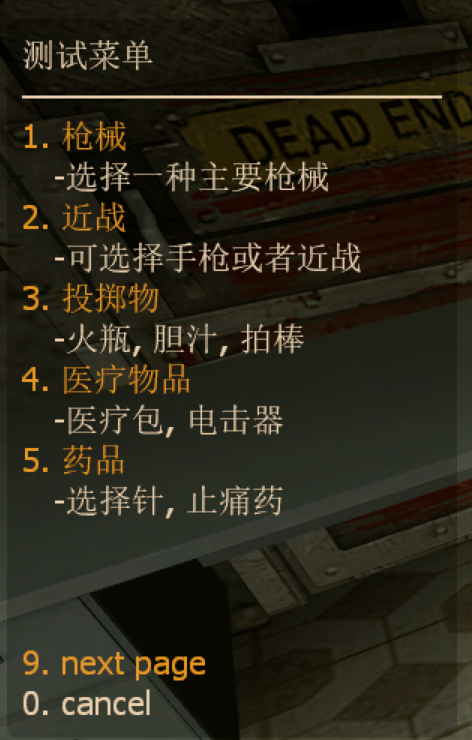

# Sourcemod L4D2 开发向插件
该仓库面向具有一定插件写作能力的玩家
* * *
## SMTP Mail
> *English introduction please view [this](https://forums.alliedmods.net/showthread.php?p=2815083#post2815083)*  
这是一个基于sm curl拓展实现发送邮件的插件, 旨在简化curl拓展提供的api. app文件夹提供基于该插件的额外功能  
curl拓展作者以及后续fork 请到上方英文介绍页底部鸣谢寻找.
<table>
    <tr>
        <td>windows</td>
        <td>x</td>
        <td>windows</td>
        <td>√</td>
    </tr>
</table>

#### 接口使用: 
<details>

<summary>详细信息</summary>

```sourcepawn  

Action Cmd_Status(int client, int args) 
{
    if( client < 1 || client > MaxClients || !IsClientInGame(client) || IsFakeClient(client) )
        return Plugin_Handled;

    SMTP mail = new SMTP(smtp_host, smtp_port);
    mail.SetVerify(smtp_encryption, smtp_verifyhost, smtp_verifypeer);
    mail.SetSender(account_username, account_password);
    mail.SetTitle("mail title");
    mail.AppendInfo("your mail info first line");
    mail.AppendInfo("your mail info second line");
    mail.AppendInfo("your mail info third line");

    mail.AddRecipient("xxx@xxx.com");
    mail.AddRecipient("zzz@zzz.com");

    mail.Send(MailSendResult);

    return Plugin_Handled;
}

void MailSendResult(int code, const char[] message)
{
    if( code != SEND_SUCCESS )
    {
        LogError(message);
        return;
    }

    LogMessage(message);
}
```
</details>

#### 已确认问题: 
+ 仅支持 linux 服务器, 因为目前 curl 拓展只有linux版本的.
+ 请注意curl拓展是否生效, curl拓展不生效请在控制台输入 sm exts load curl 检查不生效原因, 并自行查找解决办法.
+ curl拓展在服务器处于休眠状态下无法正确运行, 不清楚是什么问题引起的. 未来的SMTP Tool将会强制锁定服务器不能处于休眠状态. 额外插件中 l4d2_updatecheck 已经使用该功能. 请确保服务器"sv_hibernate_when_empty"的值为0
#### 可选插件说明:  
[(推荐)l4d2_updatecheck](https://github.com/Miuwiki/L4D2-developer-plugins/tree/main/SMTP-mail/app/l4d2_updatemail)
> 该插件提供服务器更新提示, 当服务器过期时会发送邮件给管理员提示更新服务器.  
+ 使用本插件时请检查主插件是否正常运行!  
+ 本插件不会自动生成.cfg配置文件, 请手动更改源码内的cvar或者写在server.cfg中.  
+ 添加收件人邮箱务必在每个邮箱后添加","号, 最后一个也要添加.  
* * *

### List Menu
> *English introduction please view*  
提供附带说明的菜单, 简化二级菜单操作流程

<table>
    <tr>
        <td>windows</td>
        <td>√</td>
        <td>windows</td>
        <td>√</td>
    </tr>
</table>

#### 接口使用: 
<details>

<summary>详细信息</summary>

```sourcepawn
static char string[][][] = {
	{"枪械", "选择一种主要枪械"},
	{"近战", "可选择手枪或者近战"},
	{"投掷物", "火瓶, 胆汁, 拍棒"},
	{"医疗物品", "医疗包, 电击器"},
	{"药品", "选择针, 止痛药"},
	{"buff", "选择一种buff"}
};

Action Cmd_ShowTest(int client, int args)
{
	ListMenu listmenu = ListMenu(ListMenuHandler_ShowData);
	char title[128], name[128], description[128];

	Format(title, sizeof(title), "测试菜单\n——————————————");
	listmenu.SetTitle(title);

	for(int i = 0; i < sizeof(string); i++)
	{
		FormatEx(name, sizeof(name), "%s", string[i][0]);
		FormatEx(description, sizeof(description), "%s", string[i][1]);

		listmenu.AddItem(name, description);
	}

	listmenu.Send(client, 20);

	return Plugin_Handled;
}

void ListMenuHandler_ShowData(int client, int index[2], ListData item)
{
	if( client < 1 || client > MaxClients || !IsClientInGame(client) )
		return;
	
	PrintToChatAll("item passdata handle %d", item.passdata);
	int passdata[2];
	if( item.passdata != INVALID_HANDLE )
	{
		item.passdata.GetValue("key1", passdata[0]);
		item.passdata.GetValue("key2", passdata[1]);
	}
	else
	{
		PrintToChatAll("no data pass by item");
	}

	PrintToChat(client, "you select item index %d\ndata index %d\nitem_name: %s\nitem_description: %s\npassdata: %d-%d", 
						index[0], index[1], item.name, item.description, passdata[0], passdata[1]);
}
```
</details>

<details>

<summary>效果图</summary>



</details>

#### 已确认问题: 
+ 暂无
#### 可选插件说明:
+ 暂无
* * *
